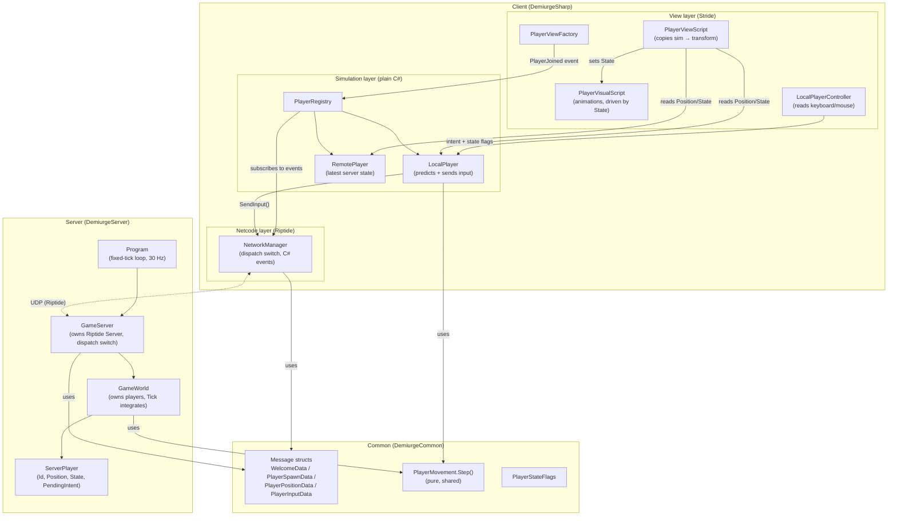

# Networking Architecture

Server-authoritative multiplayer built on [Riptide](https://github.com/RiptideNetworking/Riptide).
Clients send **inputs**, the server integrates movement at a fixed 30 Hz tick and
broadcasts authoritative positions. The local player is predicted client-side by
running the same shared movement function the server runs.

## Layers and ownership

Dependencies point downward only. Nothing below the view layer touches Stride;
nothing above the netcode layer touches Riptide's `Message`.



## Message flow

```mermaid
sequenceDiagram
    participant C as Client A<br/>(NetworkManager)
    participant S as Server<br/>(GameServer → GameWorld)
    participant O as Client B<br/>(NetworkManager)

    C->>S: connect
    S->>C: Welcome { ClientId } (reliable)
    Note over S: GameWorld.AddPlayer(A)
    S->>C: PlayerSpawn { B, pos } (existing players, reliable)
    S->>C: PlayerSpawn { A, pos } (reliable)
    S->>O: PlayerSpawn { A, pos } (reliable)
    Note over C,O: PlayerRegistry creates LocalPlayer / RemotePlayer,<br/>raises PlayerJoined → PlayerViewFactory spawns entity

    loop every frame (client)
        Note over C: LocalPlayerController reads input.<br/>LocalPlayer predicts with PlayerMovement.Step()
        C->>S: PlayerInput { Sequence, Intent, State } (unreliable)
        Note over S: GameWorld.ApplyInput stores PendingIntent + State
    end

    loop every tick (server, 30 Hz)
        Note over S: Position = PlayerMovement.Step(pos, PendingIntent, State, dt)<br/>for every player
        S->>O: PlayerPosition { A, pos } (unreliable, owner excluded)
        S->>C: PlayerPosition { B, pos } (unreliable, owner excluded)
        Note over C,O: PlayerRegistry updates RemotePlayer.Position;<br/>own id is ignored (prediction owns the local player)
    end
```

## Rules of the road

- **Wire format lives in one place.** Every message is a struct in
  `Common/Messages/` implementing `IMessageSerializable`. Field order is defined
  once, inside the struct — never inline `Add*/Get*` calls at a send/receive site.
- **Handlers are thin.** `NetworkManager` / `GameServer` own the only `switch` on
  message ids. They deserialize and hand typed data to the sim layer (client:
  C# events → `PlayerRegistry`; server: direct calls → `GameWorld`). They never
  touch entities or game rules.
- **The sim layer is engine-free.** `PlayerRegistry`, `LocalPlayer`,
  `RemotePlayer`, `GameWorld`, `ServerPlayer` use `System.Numerics` and know
  nothing about Stride. Conversion to `Stride.Core.Mathematics` happens at the
  view boundary (`.ToStride()`).
- **Movement is a pure shared function.** `PlayerMovement.Step()` is the single
  source of truth for how intent becomes motion. Client prediction and server
  authority stay consistent because they are literally the same code.
- **`useMessageHandlers: false` everywhere.** Riptide's reflection-based
  `[MessageHandler]` attributes are disabled; dispatch is explicit.

## Where the next features go

| Feature | Home |
|---|---|
| Remote player interpolation | `PlayerViewScript` (lerp toward sim state instead of snapping) |
| Prediction reconciliation | `LocalPlayer` (buffer unacked inputs, replay on server correction using `Sequence`) |
| New message type | Struct in `Common/Messages/` + enum entry + one case in each dispatch switch |
| New gameplay rule | `GameWorld.Tick` (server) / sim layer (client) |
| New visual reaction to network events | Subscribe to `PlayerRegistry` / `NetworkManager` events from the view layer |
